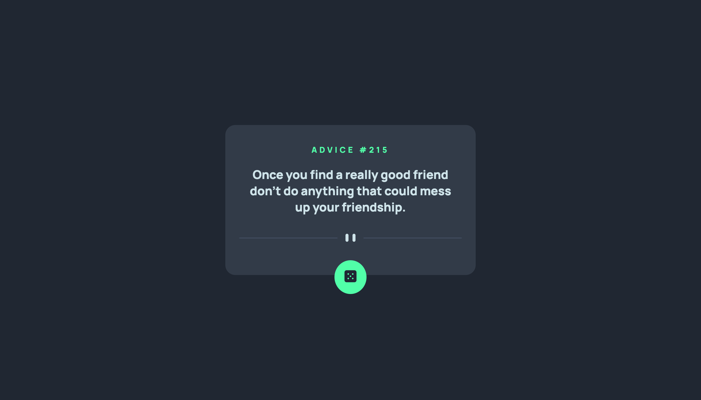

# Frontend Mentor - Advice generator app solution

This is a solution to the [Advice generator app challenge on Frontend Mentor]. Frontend Mentor challenges help you improve your coding skills by building realistic projects.

## Table of contents

- [Overview](#overview)
  - [The challenge](#the-challenge)
  - [Screenshot](#screenshot)
  - [Links](#links)
- [My process](#my-process)
  - [Built with](#built-with)
  - [What I learned](#what-i-learned)
- [Author](#author)
- [Acknowledgments](#acknowledgments)

## Overview

### The challenge

Users should be able to:

- View the optimal layout for the app depending on their device's screen size
- See hover states for all interactive elements on the page
- Generate a new piece of advice by clicking the dice icon

### Screenshot

### Links

- [Solution URL](https://github.com/annapmarin/advice-generator-app)
- [Live Site URL](https://annapmarin.github.io/advice-generator-app)

## My process

### Built with

- Semantic HTML5 markup
- CSS custom properties
- Flexbox
- CSS Grid
- [React] - JS library
- [Next.js] - React framework
- [Advice Slip](https://api.adviceslip.com/) - JSON API

### What I learned

I learned to consume an API with React JS (practice of useState, useEffect & fetch-async-await)

## Author

- [GitHub](https://github.com/annapmarin)
- [Frontend Mentor](https://www.frontendmentor.io/profile/annapmarin)

## Acknowledgments

Thanks to Cristina Seva & Guillermo Ruiz for helping me out with some doubts.